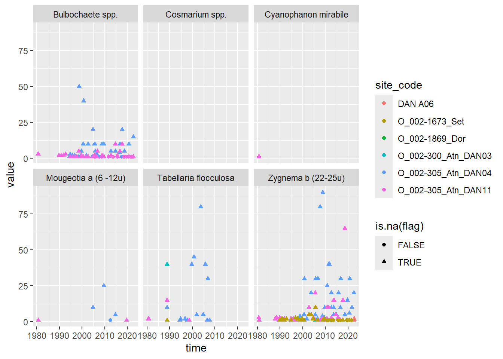

**Putting a phytobenthos export file (excel) from Aquamonitor on 'long' format**  

* Original file has 4 rows in the heading, 2 for site (code and name), 1 for time, 1 for project    
* Data are given in the format "< 1" when the data are under "LOQ" (presumably always 1 since these are counts....)     
* Solution:  
    - Use combination "site code + time" (separated by '___') as the header for the main data   
    - Reshape using 'pivot_longer', splitting site code + time again   
    - Remove "<" and replace decimal comma by decimal point to get values  
    - Add 'flag' variable for "<" values  
    - Add site name and project  

## Packages


::: {.cell}

```{.r .cell-code}
library(readxl)
library(dplyr)    # or use library(tidyverse)
library(tidyr)    # or use library(tidyverse)
library(lubridate)

library(ggplot2)
```
:::


## Data  


::: {.cell}

```{.r .cell-code}
dat_orig <- read_excel("Input_data/0601_TaxonList_phytobenthos_AM_16.3.2023.xlsx", 
                       col_types = "text", col_names = FALSE) %>%
  as.data.frame()

dat_header <- dat_orig[1:4, -(1:3)]   # will be used for 'metadata' for stations  
dat_data <- dat_orig[-(1:4),]

# Column name: set to site + date, with 3 underscores between  
names(dat_data) <- c(dat_orig[4,1:3], paste0(dat_header[2,], "___", dat_header[4,]))

# Make data
dat <- dat_data %>%
  # Rearrange data to 'long/tall' (keep MethodName, TaxonCode, TaxonName as the first columns)
  pivot_longer(
    -c(MethodName, TaxonCode, TaxonName), 
    names_to = c("site_code", "time_string"), 
    values_to = "value_string", names_sep = "___") %>%    # pplits the 
  # Remove rows with no values in 'value'
  filter(!is.na(value_string)) %>%
  mutate(
    time = dmy_hms(time_string),
    # Get numerical values + less-than flag using sub and grepl 
    #   'fixed = TRUE' means that search string (eg., '<') is to be taken literally
    value_temporary = sub("<", "", value_string, fixed = TRUE),
    # Replace decimal comma by decimal point to get values
    value = sub(",", ".", value_temporary, fixed = TRUE) %>% as.numeric(),
    # Flag for < 
    flag = ifelse(grepl("<", value_string, fixed = TRUE), "<", as.character(NA))
    ) %>%
  select(-value_temporary)
```

::: {.cell-output .cell-output-stderr}

```
Warning: There was 1 warning in `mutate()`.
ℹ In argument: `value = sub(",", ".", value_temporary, fixed = TRUE) %>%
  as.numeric()`.
Caused by warning in `sub(",", ".", value_temporary, fixed = TRUE) %>% as.numeric()`:
! NAs introduced by coercion
```


:::

```{.r .cell-code}
# Get metadata for stations (names + project)
dat_meta <- t(dat_header[1:3,]) %>% as.data.frame() 
names(dat_meta) <- c("project", "site_code", "site_name") 
dat_meta <- dat_meta %>%
  distinct(site_code, site_name, project)

# Check that there are one project / name per site_code
check <- dat_meta %>% add_count(site_code) %>% filter(n > 1)

# Add metadata for stations  
if (nrow(check)>0){
  stop("Some site_code have several names or several projects")
} else {
  dat <- dat %>%
    left_join(dat_meta, by = "site_code")
}
```
:::


## Test plot  


::: {.cell}

```{.r .cell-code}
# Most common taxa and sites
selected_taxa <- table(dat$TaxonName) %>% sort(decreasing = TRUE) %>% names() %>% head(6)
selected_sites <- table(dat$site_code) %>% sort(decreasing = TRUE) %>% names() %>% head(6)

ggplot(dat %>% filter(TaxonName %in% selected_taxa & site_code %in% selected_sites),
       aes(time, value, color = site_code, shape = is.na(flag))) +
  geom_point() +
  facet_wrap(vars(TaxonName))
```

::: {.cell-output .cell-output-stderr}

```
Warning: Removed 708 rows containing missing values or values outside the scale range
(`geom_point()`).
```


:::

::: {.cell-output-display}
{width=672}
:::
:::
